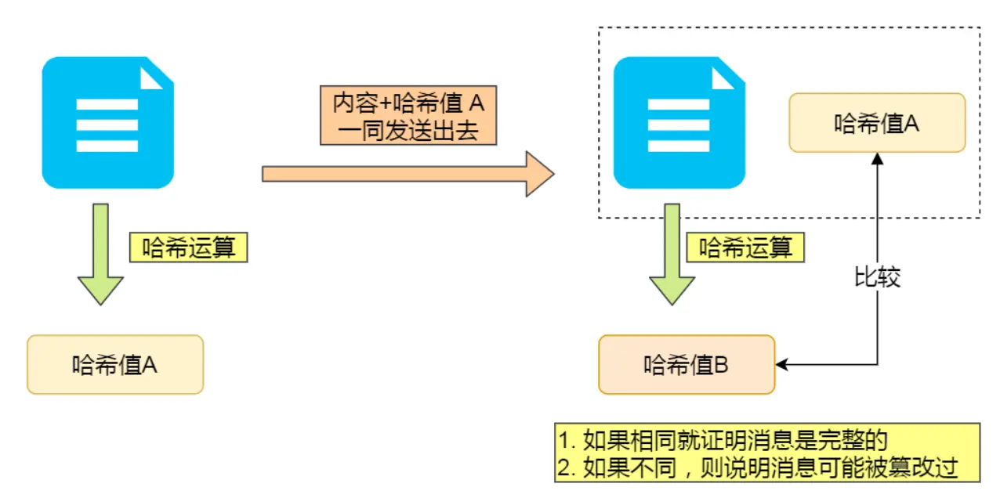
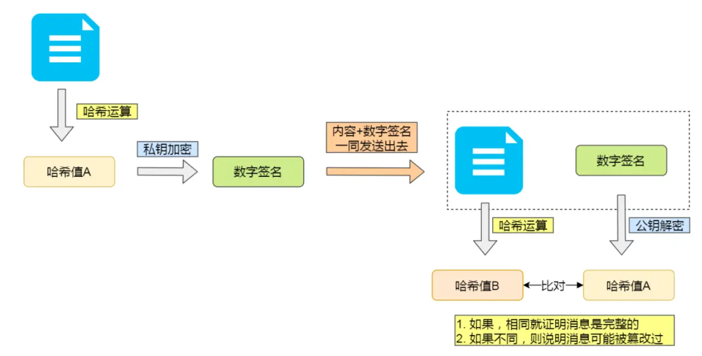
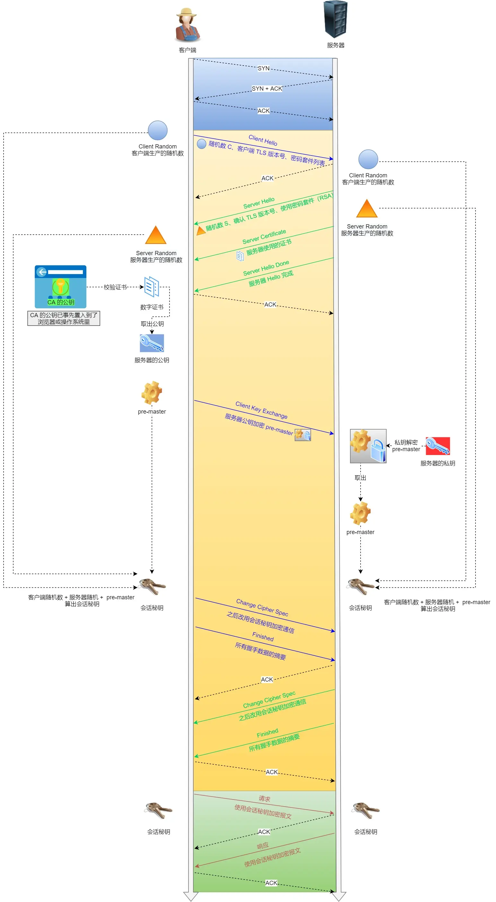

# HTTP/https

### HTTP三个问题
- 被窃听风险：明文传输
- 被篡改
- 被中间者截获

### SSL/TLS
#### 对称加密
双方使用同一个密钥来加密解密

#### 非对称加密
公钥加密，私钥解密：保证内容传输安全
私钥加密，公钥解密：保证消息不被冒充，注意这种方式不能用于信息传递，因为所有人都有公钥，所以仅仅用于验证
例如：
- rsa算法
- ecc椭圆曲线算法

#### 对称加密和非对称加密是否能保证信息安全
*混合加密的方式实现信息的机密性，解决了窃听的风险*
1. 对称加密需要双方都有共同密钥，但是一旦**明文传输密钥**，就不安全了
2. 让对方定义一个密钥a，然后把公钥给对方，对方用公钥加密后传过来，就可以用私钥解密得到a了
3. 非对称加密可以保证信息传输不被看到，但是不能防范中途被截获：例如我发给h一个公钥，公钥被一个中间者截获，中间者m偷梁换柱发了自己的公钥给h，然后h用m的公钥加密了密钥a，发出又被m截获，m拿自己的私钥解密获取了密钥a，然后用原来的公钥加密a，传回给我，这样我和h的密钥a就给中间者m掌握了，并且我们毫不知情。

#### 数字证书
*数字证书解决被中间者截获的问题*
通过第三方权威机构来验证发送公钥方的身份

#### 摘要算法+数字签名
*摘要算法和数字签名用来确保内容完整，结合非对称加密和证书验证，可以确保信息不被篡改*
使用摘要算法计算内容哈希，然后把内容和哈希值一起发出，对方接受到后比对内容和哈希值，确保信息传递完整。**但依然不能避免被篡改**

结合非对称加密，使用私钥加密哈希值，形成数字签名，对方用公钥解密得到哈希值，再进行内容比对。**但公钥也可能是中间人伪造的**

所以还要结合证书验证，这样就能保证信息传递是完整的并且不被篡改

### HTTPS建立握手
