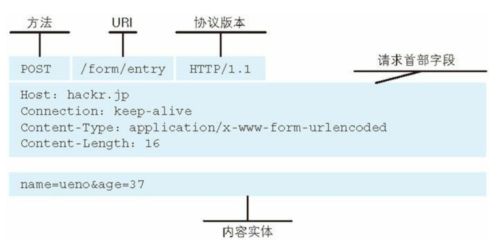
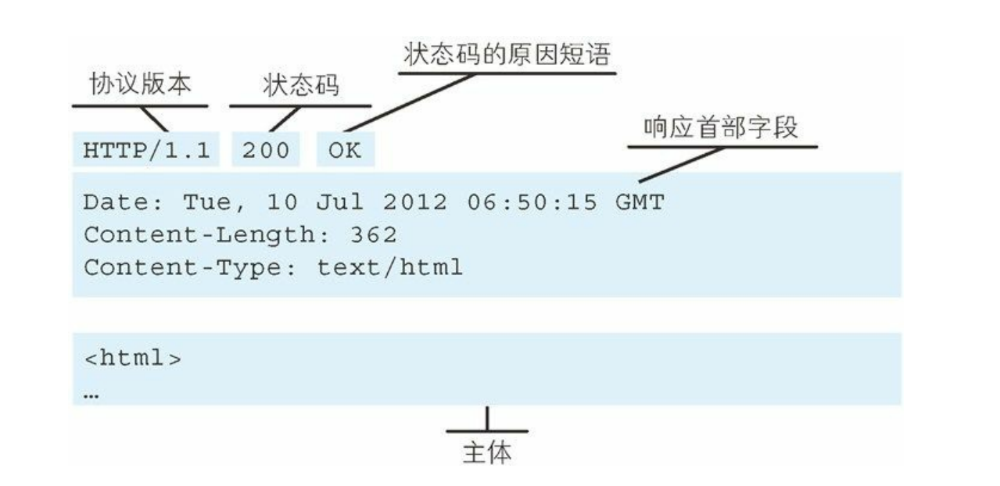
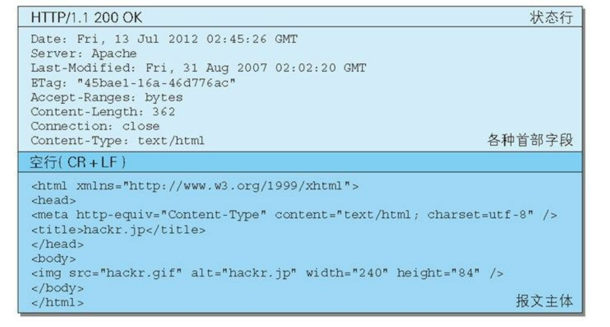
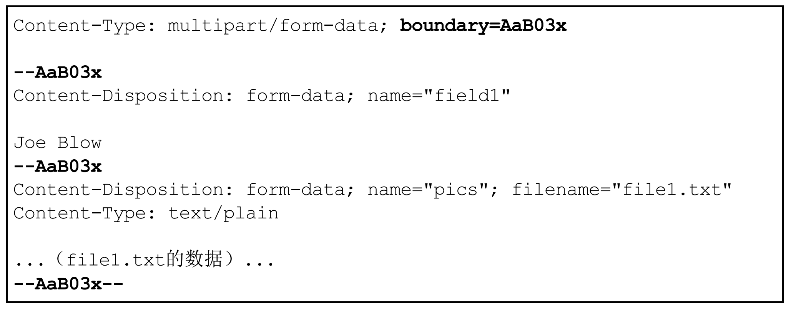

# HTTP/简单http协议
### HTTP结构
#### 请求报文

- request line 请求行
  - method 方法
  - URI 
  - version 协议版本
- header
- body

#### 响应报文

- status line 状态行 
  - version 协议版本
  - status code 状态码
  - reason-phrase 原因短语
- header
- body

### HTTP方法
- GET：获取资源
- POST：传输body
- PUT：传输文件
- HEAD：只获取header部分而不获取body
- DELETE：按URI删除资源
- OPTIONS：询问支持的http方法
- TRACE：追踪路径
- CONNECT：CONNECT 方法要求在与代理服务器通信时建立隧道，实现用隧道协议进行 TCP 通信。主要使用 SSL（Secure Sockets Layer，安全套接层）和 TLS（Transport Layer Security，传输层安全）协议把通信内容
加 密后经网络隧道传输

### MIME机制
Multipurpose Internet Mail Extensions: 多用途因特网邮件扩展
- multipart/formdate
  
- multipart/byteranges