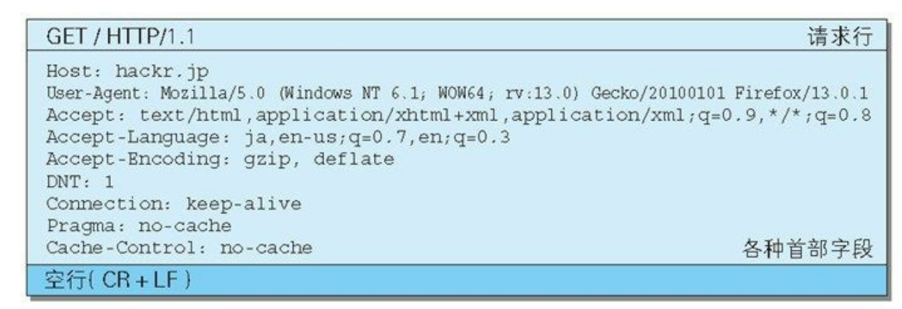

- [HTTP/简单http协议](#http简单http协议)
    - [HTTP结构](#http结构)
      - [请求报文](#请求报文)
      - [响应报文](#响应报文)
    - [HTTP方法](#http方法)
    - [MIME机制](#mime机制)
    - [http常见状态码](#http常见状态码)
    - [http缓存](#http缓存)
  - [https](#https)

# HTTP/简单http协议
### HTTP结构
#### 请求报文

- request line 请求行
  - method 方法
  - URI 
  - version 协议版本
- header
- body

#### 响应报文

- status line 状态行 
  - version 协议版本
  - status code 状态码
  - reason-phrase 原因短语
- header
- body

### HTTP方法
- GET：获取资源
- POST：传输body
- PUT：传输文件
- HEAD：只获取header部分而不获取body
- DELETE：按URI删除资源
- OPTIONS：询问支持的http方法
- TRACE：追踪路径
- CONNECT：CONNECT 方法要求在与代理服务器通信时建立隧道，实现用隧道协议进行 TCP 通信。主要使用 SSL（Secure Sockets Layer，安全套接层）和 TLS（Transport Layer Security，传输层安全）协议把通信内容
加 密后经网络隧道传输

### MIME机制
Multipurpose Internet Mail Extensions: 多用途因特网邮件扩展
- multipart/formdate
  
- multipart/byteranges

### http常见状态码

### http缓存
1. **强制缓存**
   服务器在返回资源的同时，在响应头设置cache-control(相对时间)或Expires(绝对时间)，前端下次请求该资源时，先检查资源是否已经超时，没有则直接使用本地缓存
$$ \space $$

2. **协商缓存**
   
   - **机制1**：使用if-modified-since字段和last-modified字段，浏览器请求资源时会带上上次请求资源响应头中的last-modified作为if-modified-since，服务器对比如果last-modified > if-modified-since，则返回资源和200；否则返回304告诉浏览器把资源重定向到缓存
   - **机制2**：使用etag和if-none-match两个字段
     - 第一次请求资源时，响应头返回资源etag
     - 第二次请求，浏览器在请求头的if-none-match字段带上etag，服务器对该etag进行匹配，如果匹配不到，如果资源变化了返回新资源，否则返回304 

## https
[[https]]
