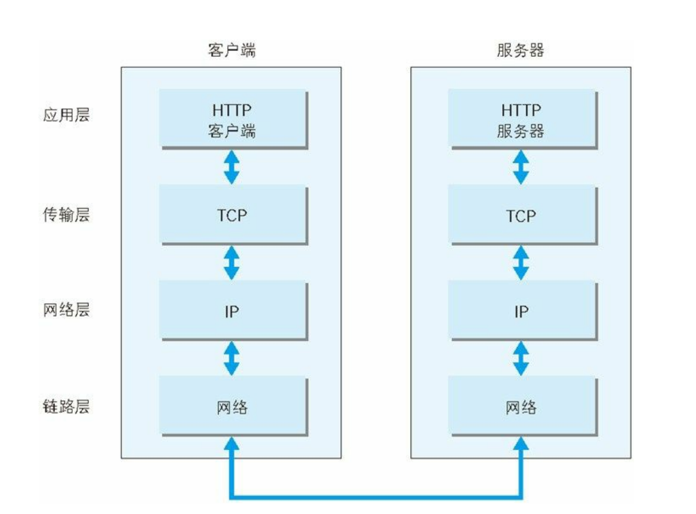
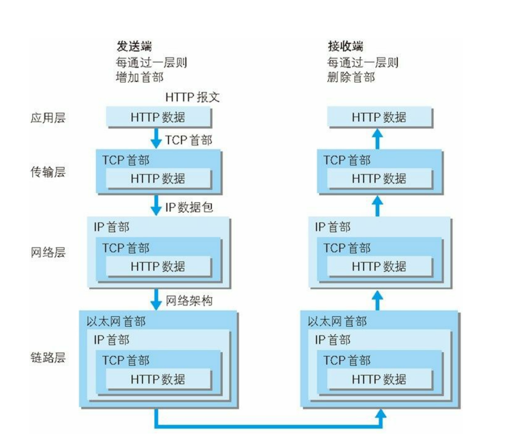
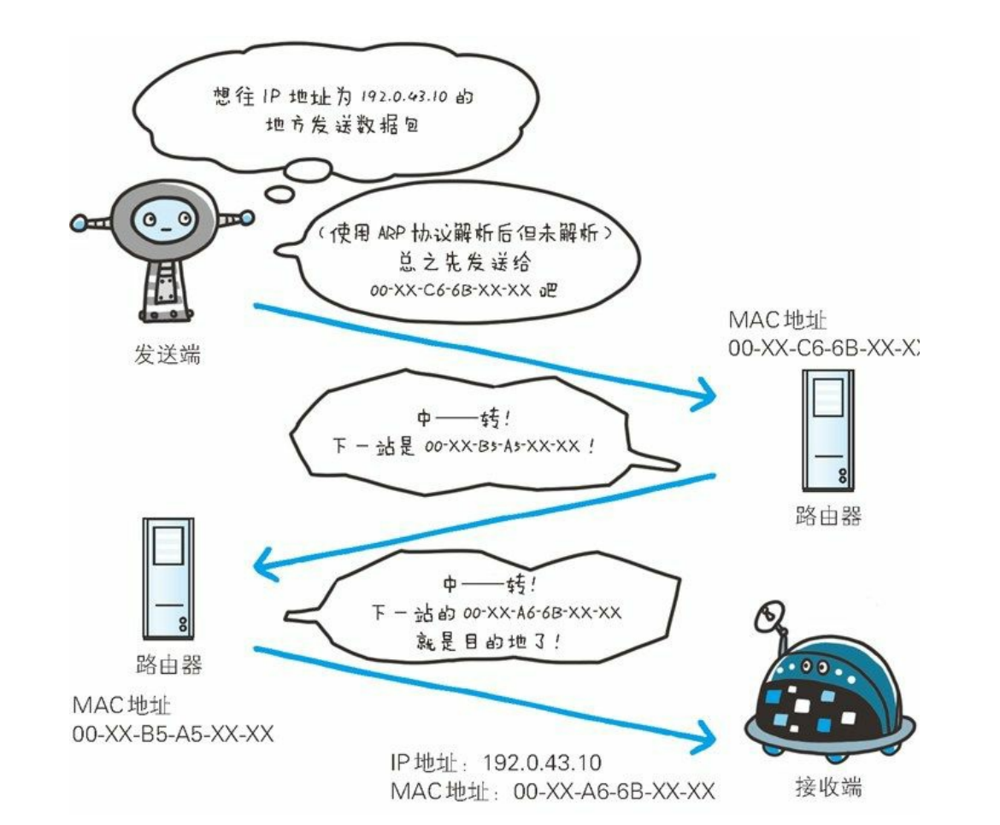
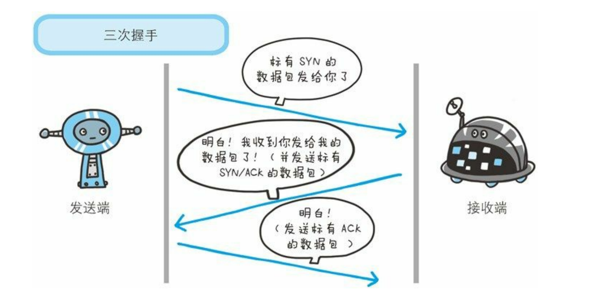
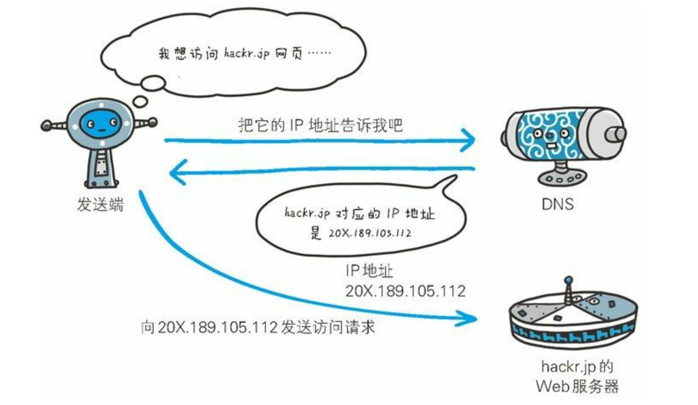
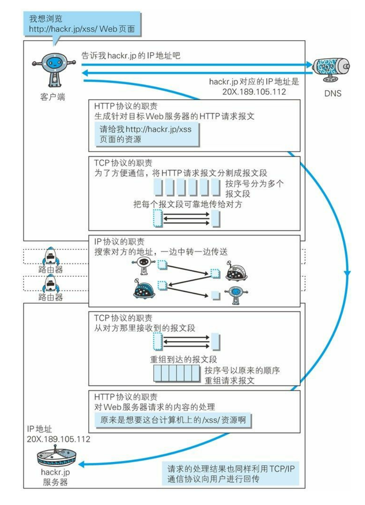
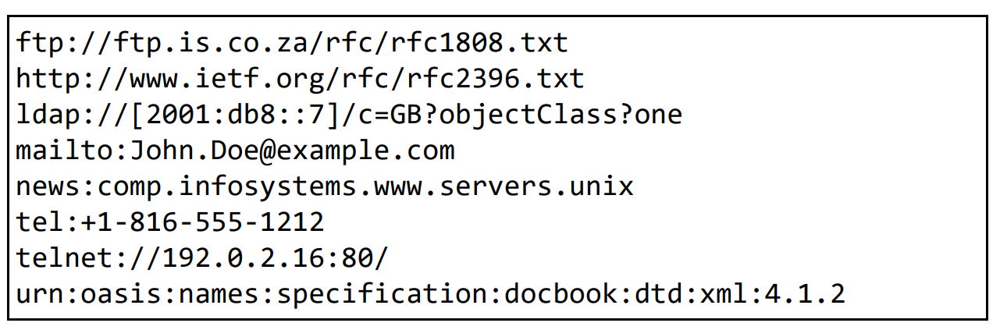
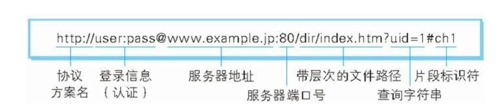

### TCP/IP

- 应用层：由应用层实现，处理特定应用的细节，例如如何decode，对原始的数据流进行反序列化，例如
  - ​HTTP​：用于传输网页。
  - ​HTTPS​：安全的 HTTP。
  - ​FTP​：用于文件传输。
  - ​DNS​：将域名（如 www.google.com）解析为 IP 地址。
  - SMTP/POP3/IMAP​：用于发送和接收电子邮件。
  - SSH​：安全的远程登录。
- 传输层：TCP/UDP协议，由操作系统实现，端口到端口
- 网络层：IP协议，这一层实现从设备到设备的传输
  - 主机 -> 路由1 -> 路由2 -> ... -> 路由N -> 目标设备
  - 每台设备都实现了ip协议栈
- 链路层：处理与物理传输介质（如电缆、光纤、无线电波）相关的所有细节。它包括操作系统中的设备驱动程序和计算机中对应的网络接口卡。
  - 以太网、Wi-Fi、PPP

### IP协议

- ARP协议：利用ip地址反查出下一站的mac地址

### tcp协议

- tcp协议提供可靠的字节流传输服务
- 将大块数据分割成以文段为单位的**数据包**，分割的目的是为了可靠传输，通过确保每个数据包成功被对方接收，并且管理数据包顺序，来确保数据被可靠传输
- 用三次握手来确保数据包被接收

### DNS

### HTTP在协议层中的位置

### URL 
- uniform resources locator 统一资源定位符
- 表示资源在互联网上的地址
- https://www.baidu.com

### URI 
- uniform resources identifiers 统一资源标识符
- 某个具体资源唯一确定的资源定位符
- 

### URI格式
  
- 协议名：必选
- 认证信息：可选
- 服务器地址：必选
- 端口号：可选，没有则使用默认端口号 http 80， https 443，ssh 22
- 带层次文件路径
- 查询字符串：可选，表单格式
- 片段标识符：标记出已获取资源中的子资源（文档内的某个
位置）

