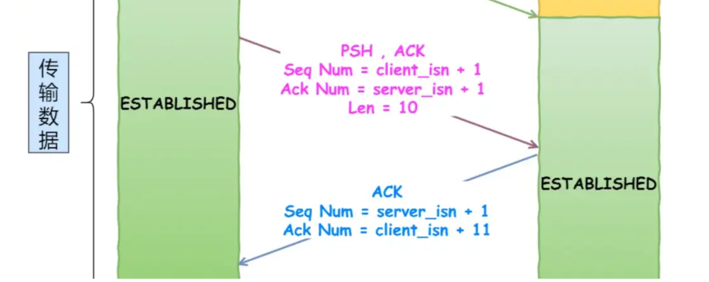
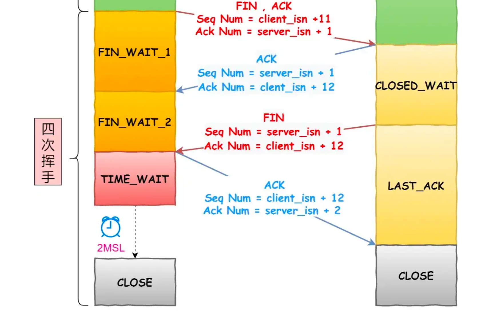

# TCP/tcp
## tcp主要过程
### tcp要解决的问题
- 可靠连接
- 确保每个包别成功接收
- 维护包的顺序

### 建立连接：三次握手

1. 客户端发SYN包，表示希望建立连接，状态由CLOSE -> SYN_SENT
2. 服务端收到SYN包，发送SYN+ACK包，表示同意建立连接，状态由LISTEN -> SYN_RCVD 
3. 客户端接收到SYN+ACK包，回复ACK包，表示接收到了服务端回应，SYN_SENT -> ESTABLISHED
4. 服务端接收到ACK包，状态从SYN_RCVD -> ESTABLISHED

### 一发一收

- Seq Num = 上一个包的 Seq Num + 上一个len 
- Ack Num = 接收到的 Seq Num + 当前len

### 关闭连接：四次挥手

1. 客户端发送FIN包，表示不再发送新的包，进入FIN_WAIT_1状态
2. 服务端收到FIN包，马上发送ACK，表示收到，接着会把还没发送完的包继续放松给客户端
3. 发送完所有数据后，服务端发送FIN包
4. 客户端收到FIN包后，发送ACK包确定1；客户端等待一段时间后，进入close
5. 服务端收到后，马上close