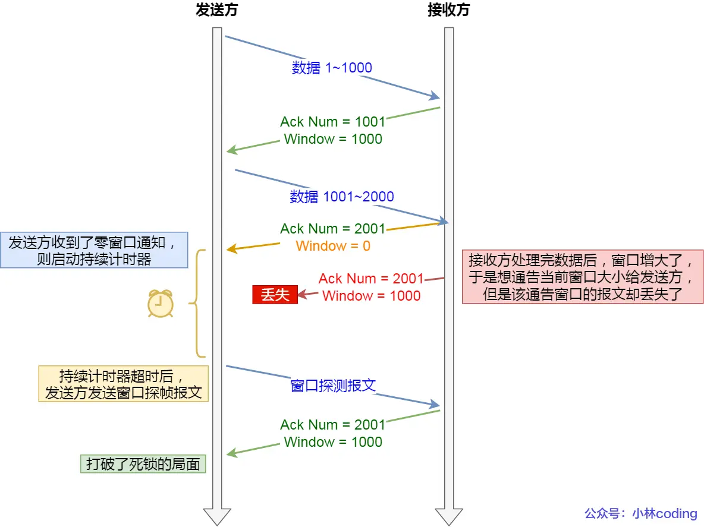

# TCP/流量控制

### 窗口关闭
如果ACK包告知发送方窗口为0，那么发送方就会阻塞等待直到收到窗口非0的报文。
那如果这个包丢失了
发送方就死锁了

#### 解决方案

### 糊涂窗口
接收方处理过慢，发送窗口越来越小，直到不经济
#### 解决方案
1. **让接收方不通知小窗口给发送方**
    接收窗口大小小于 min(MSS, 缓存空间/2),就向发送方通知窗口为0

2. **发送方避免发送小数据**
    达到窗口大小>=MSS并且数据大小>=MSS || 收到之前发送数据的ack回包，才发送；否则囤积数据