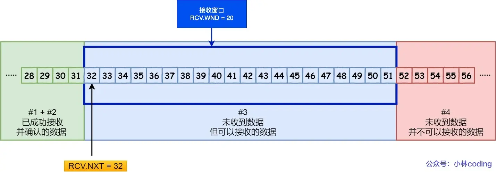

# TCP/滑动窗口

### 发送方窗口结构

### 接收方窗口结构

接收窗口大小初始时就是缓存大小，但之后接收到数据后就是动态变化的，取决于处理速度。其实就是个生产者消费者模型，缓存是一定的，消费者消费速度越快，留给生产者的接收窗口大小就越大

### 接收窗口等于发送窗口吗
初始时候应该是相等的，但中间过程中，接收窗口的大小取决于消费者消费速度，所以往往不等于接收窗口，除非接收方可以瞬间处理完所有数据

