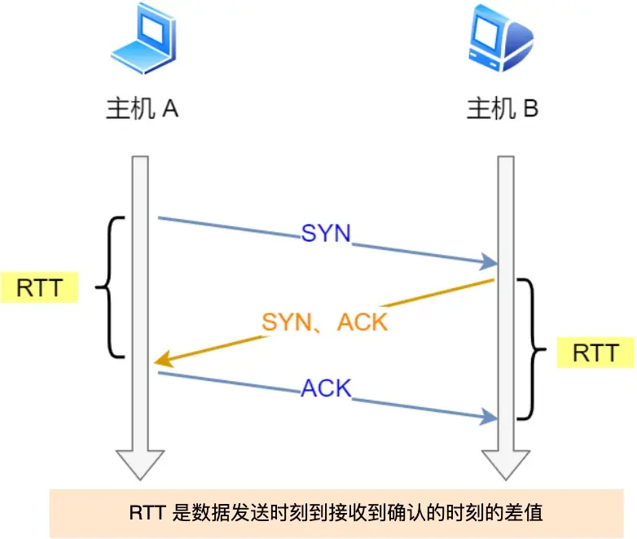
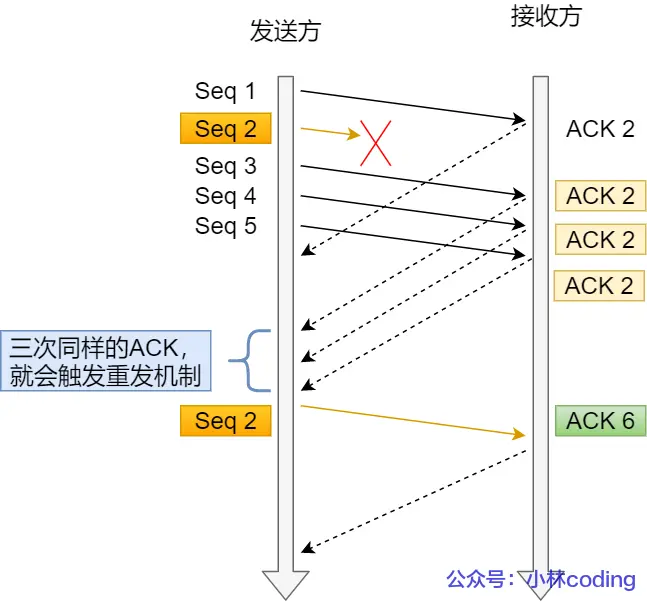
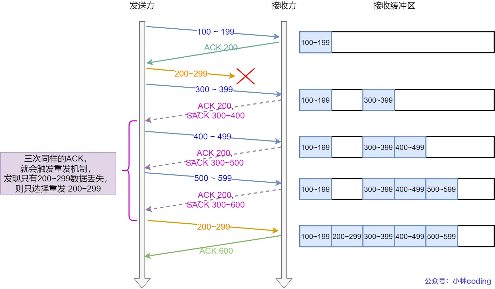

# TCP/重传机制
- [TCP/重传机制](#tcp重传机制)
  - [超时重传](#超时重传)
    - [RTO和RTT](#rto和rtt)
    - [RTO和RTT的关系](#rto和rtt的关系)
    - [存在问题](#存在问题)
  - [快速重传](#快速重传)
    - [触发机制](#触发机制)
    - [存在问题](#存在问题-1)
  - [SACK方法](#sack方法)
    - [机制](#机制)
  - [Duplicate SACK](#duplicate-sack)

## 超时重传
### RTO和RTT
- RTT: Round-Trip Time 往返时延
  - 
- RTO: Retransmission Timeout 超时重传时间

### RTO和RTT的关系
超时重传机制的核心就是确定 RTO ，如果rto太大，那么效率就低，rto太小，那么原本没有丢包也会进行反复重传，加大网络拥塞，从而造成更多的重传
理想的rto应该比rtt稍大一些
但实际上rtt是不断改变的，所以linux中会对rtt进行采样，使用一些滤波算法来得到比较理想的rtt，从而确定rto

### 存在问题
超时重传总是需要等待一段时间周期后才能进行重传，效率不高，快速重传不以时间为驱动，而以数据为去驱动

## 快速重传

### 触发机制
反复收到同一个Ack 3次，那么触发重传

### 存在问题
例如收到3次Ack 2时，并不能确定是由后续哪个包触发的，那也就不能去确定到底是只用重传2，还是要重传 2 3 4

## SACK方法
sack方法就是要告诉发送方到底缺少了哪些数据
### 机制
在tcp头部【选项】字段，将已收到信息发送给发送方，从而发送方知道应该重发哪些数据包

## Duplicate SACK
接收方告诉发送方，哪些包被重复发送了

